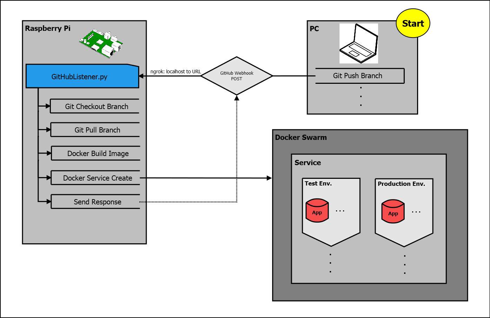
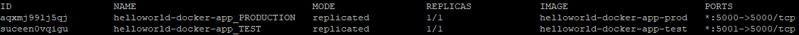
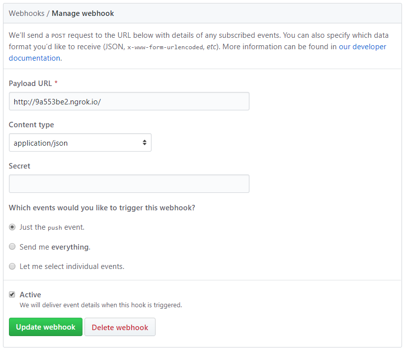
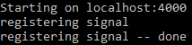

[](https://www.codacy.com/app/LeonGrund/GitHubListener?utm_source=github.com&utm_medium=referral&utm_content=LeonGrund/GitHubListener&utm_campaign=badger)
[](https://travis-ci.org/LeonGrund/GitHubListener)


# **GitHubListener**
&nbsp;



### Dependencies:
* #### Docker
* #### ngrok
&nbsp;

### Setup:
* #### [Install Docker](https://www.docker.com/get-docker)
* #### [Install ngrok](https://ngrok.com/download)
* #### [Initiate Docker Swarm](#init-swarm)
* #### Clone **this** repository
* #### Clone [helloworld-docker-app](https://github.com/LeonGrund/helloworld-docker-app) repository
* #### Run ngrok to expose localhost to URL
* #### Create GitHub webhook
* #### Run GitHubListener
* #### [Test GitHubListener][#test]
&nbsp;

#init-swarm
## Initiate Docker Swarm
* Check if Docker was installed correctly, run the following command in console: ```docker images```


* Initiate Docker Swarm: ```docker swarm init```

* Now, you can host Docker Services: ```docker service```
* Note: **GitHubListener** will automatically create and update two services for every registered application, test and production environment
* Example: ```docker service ls```
  * Production: localhost:5000
  * Test: localhost:5001


&nbsp;

## Clone GitHubListener repository
* Run the following commands at local directory where all your other Git repositories are located:
~~~
git clone https://github.com/LeonGrund/GitHubListener
~~~
&nbsp;

## Run ngrok to expose localhost to URL
* Note: Use port ```4000``` for ```GHListener.py```
  * Run commands at directory of ngrok
* Windows, run:
```
ngrok http 4000
```
* Raspberry pi:
```
./ngrok http 4000
```
&nbsp;

## Create GitHub Webhook
* Webhooks send a POST request to a specified URL every time an push event happens
* Navigate to your repositories on GitHunb and go to [**helloworld-docker-app**](https://github.com/LeonGrund/helloworld-docker-app)
* Do the following:
~~~
Settings > Webhook > Add webhook
~~~
* Use the URL generated by your ngrok:

&nbsp;

## Run GitHubListener
* Run ```GHListener.py``` in console:
~~~
python GHListener.py
~~~
* The following output should be printed in console:


&nbsp;

#test
## Test GitHubListener
* Run ```testGHL.py``` in console:
~~~
python testGHL.py
~~~
&nbsp;

## Useful Docker Commands:
* Image:
```
docker images
```
* Container:
```
docker container stop <container1_id> <container2_id> <...>
docker container rm <container1_id> <container2_id> <...>
```
* Service:
```
docker service ls
docker service rm <service1_id> <service2_id> <...>
```
&nbsp;

## Templates:
* Needed for every git repository
* Note: port ```4000:4000``` is utilized by ```GitHubListener.py```
  * Replace ```<port>:<port>``` by ```6000:6000``` for example
### _docker-commands.yaml_  
~~~
build:
  - docker
  - build
  - -t
  - NAME
  - REPO

service:
  - docker
  - service
  - create
  - -p
  - <port>:<port>
  - --name
  - SERVICE_NAME
  - IMAGE_NAME
  - rm

~~~

### _Dockerfile_
* [Dockerfile reference](https://docs.docker.com/engine/reference/builder/#cmd)
* Needed for every git repository
  * Used to build image
~~~
FROM <docker_image>

COPY <file> <path>

CMD [ "<fist_arg>", "<second_arg>" ]
~~~
* Example) ```helloworld-docker-app Dockerfile```
  * Build images with python
  * Copy ```test.py``` into image
  * Run ```test.py``` when images is run
~~~
FROM hypriot/rpi-python

COPY test.py /run

CMD [ "python", "/run/test.py" ]
~~~
&nbsp;
